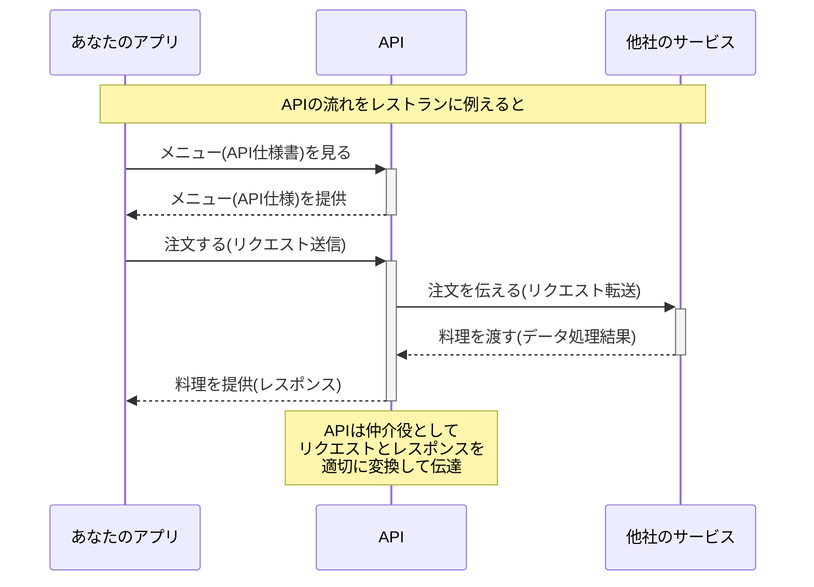

# APIとRESTの基本 - プログラミング初学者向け解説

## 💡 そもそもAPIとは？

APIは「Application Programming Interface（アプリケーション・プログラミング・インターフェース）」の略です。ちょっと難しそうな名前ですが、
**簡単に言うとソフトウェア同士がやりとりするための窓口**のことです。

例えるなら、レストランでお客さん（あなたのアプリ）と厨房（他社のサービス）をつなぐ「ウェイター」のような存在です。メニュー（APIの仕様書）に沿って注文（リクエスト）すれば、料理（レスポンス）が返ってくる仕組みです。



## 🧠 用語をざっくり理解しよう

* **アプリケーション** → ChatGPTなどの「作業をしてくれるソフトやシステム」
* **プログラミング** → ソフトに命令を出す「作り方」や「レシピ」
* **インターフェース** → 他のソフトや人が操作するための「入り口」や「つなぎ目」

## 🗺️ APIの大切さをGoogleマップで考えてみよう

皆さんはGoogleマップを使ったことがありますか？ブラウザで地図を見たり、行き先を調べたりした経験があると思います。

では、「**自分が作ったWebサイトやアプリにGoogleマップを組み込みたい**」と思ったことはありませんか？
その時に使えるのが、**Googleが提供している「Google Maps API」**なんです。APIを使えば、**自分のシステムの中にGoogleマップの機能を取り入れる**ことができるんです！

たとえば、不動産サイトで物件の場所を地図上に表示したり、飲食店のサイトで店舗の位置を示したりするのに、Google Maps APIが活用されています。

## 🤖 ChatGPTも同じ！

ChatGPTも、ブラウザ上で使えば簡単ですが、「**自社のアプリやシステムの中で使いたい！**」と思ったらどうなるでしょう？

普通にやると…
* 高性能なサーバー（GPU）が必要
* 開発にもコストや時間がかかる

でも、OpenAIが提供する**ChatGPT API**を使えば、**PythonなどのプログラムからChatGPTを呼び出して使うことができる**んです！

これにより、自社の業務システムに組み込んだり、カスタマーサポートの自動化に活用したりと、様々な用途に展開できます。

## 🌐 RESTって何？よく聞くけど...

APIの中でも特によく使われているのが「**REST API**」です。REST（レスト）は「Representational State Transfer（レプリゼンテーショナル・ステート・トランスファー）」の略で、**Webサービスを設計するための共通ルール**のようなものです。

先ほどのレストランの例でRESTを考えてみましょう：

* **リソース**：提供されている料理（ユーザー情報、画像データなど）
* **HTTPメソッド**：注文の仕方
  - GET：メニューを見せてもらう（データの取得）
  - POST：新しい料理を注文する（データの作成）
  - PUT/PATCH：料理の内容を変更する（データの更新）
  - DELETE：注文をキャンセルする（データの削除）
* **エンドポイント**：料理の注文番号のようなもの（例：`/users/123`）

実際のRESTful APIの例を見てみましょう：

```
# ツイッターのツイートを取得する
GET https://api.twitter.com/tweets/12345

# 新しいユーザーを登録する
POST https://api.example.com/users

# ユーザー情報を更新する
PUT https://api.example.com/users/789
```

このようにRESTは「何を（リソース）」に対して「どうするか（HTTPメソッド）」を直感的に表現できるので、**理解しやすく使いやすい**という特徴があります。

大手のサービスのほとんどがこのRESTの考え方でAPIを提供しているので、この基本を覚えておくと様々なAPIを使えるようになりますよ！

## ✅ まとめ

* APIは**他のソフトの機能を自分のシステムに組み込む窓口**
* RESTは**Web APIの共通ルール**で、HTTPメソッドとURLで簡潔に操作を表現
* GoogleマップやChatGPTもAPIを使えば連携できる

APIとRESTの基本を理解することで、生成AIの力を自社のシステムやアプリケーションに取り入れる第一歩を踏み出せます。最初は小さな機能から試してみて、徐々にその可能性を広げていきましょう。